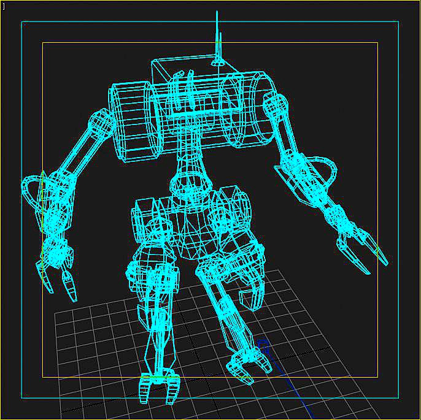
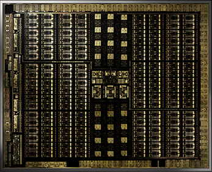
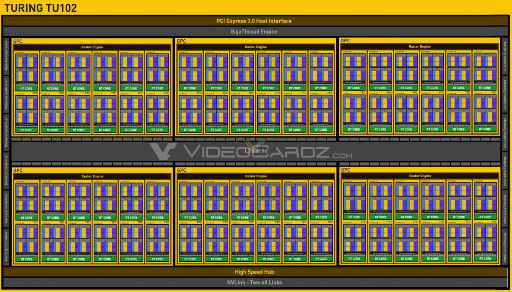

<!-- _paginate: false -->
<!-- _footer: Mark Sherman, Ph.D. \n Emmanuel College \n July 14, 2020-->
# Quick Introduction to **Parallelism**

---


### Serial Execution
* Everything you know so far is *serial*
* also called *sequential* 
or *single-threaded*
<br/>
* One thing happens at a time

---


### Parallel Execution
* Does multiple things at the same time
* Combines into one result

---

# Not Everything Works Well
- Some code can be broken up into parallel tasks easily
- Some code is fundamentally sequential

---
Which of these could be done easily in parallel?
```js
let list = [1, 1];

for(let i = 2; i < 6; i++) {
    list[i] = list[i - 1] + list[i - 2]
}
```

```js
let list = [ 1, 1, 2, 3, 5, 8 ];
let newList = [];

for(let i = 0; i < list.length; ++i) {
    newList[i] = list[i] * 2;
}
```

---
The second one.
```js
let list = [ 1, 1, 2, 3, 5, 8 ];
let newList = [];

for(let i = 0; i < list.length; ++i) {
    newList[i] = list[i] * 2;
}
```
* Each trip through the loop has no dependence on other trips
* The operation can be done on each cell in isolation

---
Let's look at the first example - the difficult one
```js
let list = [1, 1];

for(let i = 2; i < 6; i++) {
    list[i] = list[i - 1] + list[i - 2]
}
```
* The operation on `list[i]` depends on prior data
* The operations must be done in order or it breaks

---
First Example: Why it's difficult
<br/>


---
First Example: Why it's difficult
<br/>


---
First Example: Why it's difficult
<br/>


---
First Example: Why it's difficult
<br/>


---
First Example: Why it's difficult
<br/>


---
Back to the second example - the easy one

```js
let list = [ 1, 1, 2, 3, 5, 8 ];
let newList = [];

for(let i = 0; i < list.length; ++i) {
    newList[i] = list[i] * 2;
}
```
---
Back to the second example - the easy one
<br>


---
### This is called **Data-Parallel**
the same operation done over different parts of the data
* it's what we use in **Machine Learning**
* and in **Data Science**, and graphics, and most applications

---
# 3D Graphics
   

<!-- To view 3D graphics, the computer starts with a model. There are pixels on the screen or in the file, and for each pixel it needs to figure out what color would be there based on the model. This is intensely data-parallel, where each pixel can be rendered almost completely separately. -->

---

<!-- _footer: Image from NVIDIA-->
# Video Cards (GPUs)
Massively Parallel and hyper-optimized for 3D Graphics
<br/>
<br/>
<br/>
<br/>
<!-- btw at time of writing that was a $2500 video card -->

---
- This is NVIDIA's TU102 chip
- Just looking at it, you can see it has many repeated structures, supporting it's parallel nature.

<!-- _footer: Image from NVIDIA-->

---
Here's the block diagram

<!-- _footer: Diagram by videocardz.net-->
<!-- Basically, each of these little units can do a separate operation at the same time. CPUs don't have this massive parallel capacity. In a graphics card, each unit may be small, but there are tons of them. Perfect for data-parallel applications. -->

---
### Quick history of **GPGPU**
- GPU: Graphical Processing Unit
- GPGPU: General Purpose GPU

1. In the beginning, there were CPUs, general-purpose
1. Video games started happening
1. GPUs got super good at 3D video games
1. Realized GPUs were good for other work
1. Figured out how to make "general-purpose" work fit into the shape GPUs need, so you can run your operations massively parallel, and *FAST*

---
### You **can** do parallel work on a CPU
- CPUs are more versatile and more flexible
- Compute units in a CPU are faster and more capable
- CPUs have far fewer compute units than GPUs

---
#### Mark's Everyday Computer 2020

|         | Compute Units | Clock Speed     |
|---------|:-------------:|:------:         |
| **CPU** | 12            | 2,200-4,100 MHz |
| **GPU** | 768           | 907 MHz         |

#### Super-High-End Workstation

|         | Compute Units | Clock Speed     |
|---------|:-------------:|:------:         |
| **CPU** | 128           | 2,700-4,200 MHz |
| **GPU** | 8,192         | 1,410 MHz       |

<!-- Skip this slide unless someone really cares.

This is a crude comparison. There are huge differences beyond this in how the units are designed. GPUs typically have much larger cache and faster memory, for instance. A job that suits one type of processor well would be terrible on the other. 

The Everyday computer is 2018  Macbook Pro 15" with an Intel i7 and Radeon Pro 555x.

The Super-High-End is a theoretical AMD Threadripper Pro 3995WX with an NVIDIA A100, based on the Ampere architecture GA100 chip.
-->

---
You can do parallel work on multiple computers!
### This is called **Distributed Computing**
- Many individual computers networked together
    - called a *cluster*
- Computers will have CPUs and possibly GPUs, too
- Shared Storage, management, and other resources
* Most supercomuters are giant clusters

---

<!-- _footer: This image was originally posted to Flickr by Argonne National Laboratory at https://www.flickr.com/photos/35734278@N05/3323018571 -->

<!--This is a Blue Gene/P supercomputer at Argonne Nationale Laboratory. It has has 40 cabinets, with a total of 163,840 CPU cores. -->

---
# Summary
<style scoped>
section {
    font-size: 30px;
}
</style>
- Sequential vs Parallel execution
- We'll be doing Data-Parallel computing
- Same operations in parallel over different parts of the data
- Modern 3D graphics cards are data-parallel beasts
- GPGPU is the field of doing general-purpose computing using GPUs
- CPUs are different than GPUs and each has a time and a place
- Parallel execution can also be distributed over a cluster of machines
